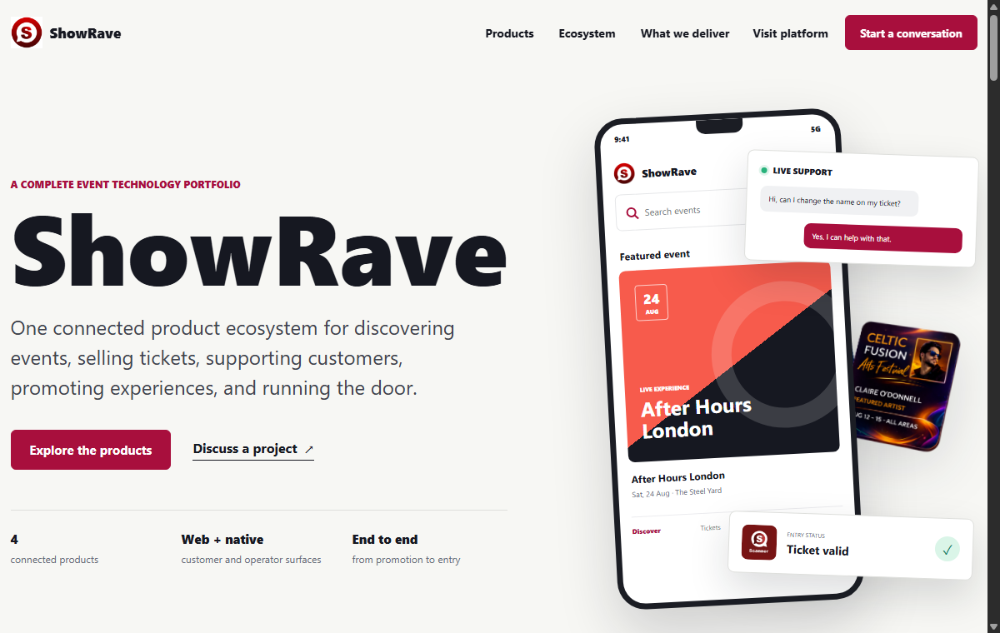
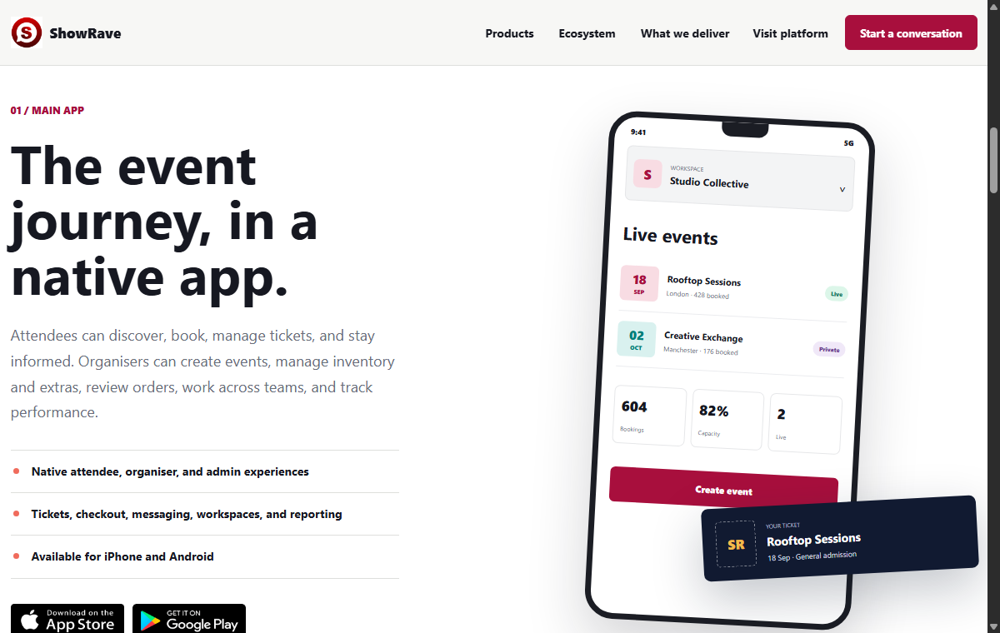
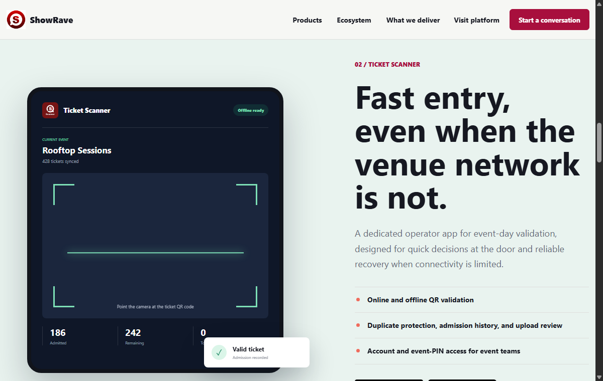
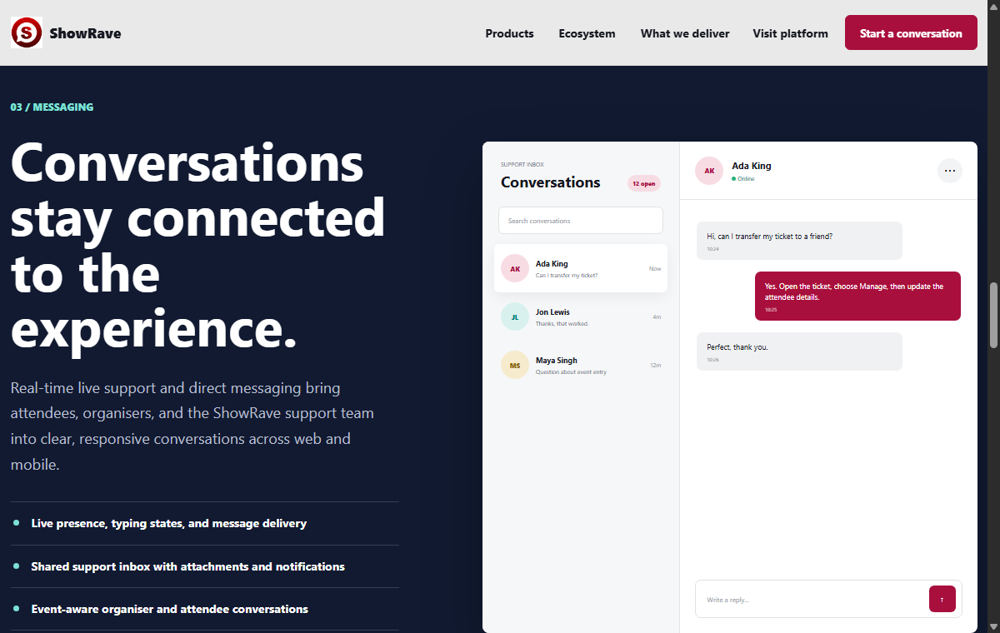

# ShowRave

ShowRave is a full event platform built for creating, promoting, discovering, booking, and managing events.

The project includes a web platform, a mobile app for iOS and Android, a dedicated ticket scanning app for door teams, real-time messaging, and a display picture generator for promotional artwork. Together they cover the full lifecycle of an event: publishing it, selling tickets, supporting attendees, and checking people in at the door.

  

## ShowRave Event Platform

The core platform lets organisers create events, sell tickets, manage attendees, and lets attendees find, book, and keep track of events.

It supports free and paid events, concerts, festivals, parties, conferences, workshops, and both public and private gatherings, online or in person.

### Event Discovery

- Search events by name, organiser, category, location, and keyword
- Browse featured, upcoming, local, online, free, and paid events
- Filter events by date, category, format, and location
- Discover destination, city, and interest-based collections
- View full event pages with dates, schedules, locations, organisers, and media
- Save events for later and share event pages
- Add event dates to a personal calendar
- Open venue locations in a maps app

### Attendee Accounts

- Create and manage a personal account with a public profile
- View saved events, bookings, orders, tickets, and notifications in one place
- Manage account details, addresses, security, and preferences
- Track a booking from order placement through to ticket delivery
- Message organisers directly and reach live support when needed
- Use referral and reward features

### Event Creation

- Create free, paid, in-person, and online events
- Add names, descriptions, categories, dates, and schedules
- Set venue, address, region, country, postcode, or online access details
- Use location suggestions or enter an address manually
- Upload event images and media
- Preview an event before publishing it
- Save drafts and return to any step to make changes
- Publish public or private events
- Edit, unpublish, revalidate, clone, or delete events

### Tickets and Seating

- Create free and paid ticket types with names, descriptions, prices, and quantities
- Configure ticket sales periods, and turn sales on or off
- Support general admission and reserved-seat tickets, including seat maps
- Track sold, available, and remaining quantities in real time
- Add new ticket types after an event has already been published
- Update ticket details without breaking existing ticket records
- Issue tickets with QR codes, including support for mobile wallets

### Extras and Add-ons

- Add merchandise, uniforms, packages, and other event extras
- Set names, descriptions, prices, quantities, and limits
- Handle delivery or collection information where needed
- Add, edit, or remove extras after an event is live
- Track sold, available, and remaining stock alongside ticket sales

### Coupons and Promotions

- Create event-specific discount coupons with codes, values, quantities, and validity dates
- Limit coupon values to the event's ticket range
- Apply full or partial coupon balances to eligible orders
- Track the remaining balance on partially used coupons
- Prevent used coupons from being edited or deleted
- Create advertising campaigns and choose promotion packages across ShowRave and social channels
- Review current and past campaign performance

### Booking and Checkout

- Combine multiple ticket types, extras, and reserved seats in a single order
- Apply valid coupons at checkout
- Collect attendee, billing, delivery, and collection details as needed
- Hold selected inventory during checkout to prevent overselling
- Process secure payments with protection against duplicate charges
- Return attendees to the correct confirmation or order screen

### Orders, Tickets, and Invoices

- View complete order histories, filterable by status
- Track successful, pending, failed, refunded, and cancelled orders
- Generate professionally formatted PDF invoices and tickets
- Display ticket holder, event, seating, and admission details
- Keep formatting consistent across screens and documents
- Retain booking and payment records for future reference

### Organiser Workspaces

- Manage personal and organisation workspaces separately
- Switch the active workspace across events, orders, finance, and reporting
- Invite team members and assign roles and permissions
- Grant door teams event-specific scanner access without exposing anything else

### Event Management

- View live, private, draft, completed, and unpublished events
- Manage tickets, extras, coupons, attendees, and scanner access from a central hub
- Edit event details without disrupting existing bookings
- Monitor inventory and manage event visibility

### Finance and Payouts

- Track gross sales, fees, earnings, and available balance
- Review individual transactions and payout history
- Request payouts and manage bank details
- Keep free-event bookings separate from paid orders for clean reconciliation

### Analytics and Reports

- Track ticket sales, bookings, revenue, and transaction trends
- Filter data and export properly formatted spreadsheet reports
- Review campaign and promotion performance
- Retain event records after an event has ended

### Messaging and Notifications

- Send direct messages between attendees and organisers
- Route event-related and general support conversations into one inbox that any authorised team member can answer
- Show typing and presence indicators, and support attachments
- Combine push and in-app notifications into a single flow that opens the right screen

### Support and Administration

- Manage users, organisers, events, orders, and payments
- Support attendees and organisers through live chat and support tickets
- Oversee scanner devices, activity, reports, and access
- Manage platform notifications, campaigns, content, and translations
- Review operational analytics and error reports

## ShowRave App

The mobile app brings the attendee, organiser, and admin experiences to iPhone and Android.

  

**Attendees** can discover events, book tickets and reserved seats, apply coupons, manage orders and tickets, add tickets to a mobile wallet, message organisers, and manage their account, all from the app.

**Organisers** can switch between attendee and organiser mode, work across personal and organisation workspaces, create and publish events through a guided native flow, manage tickets and finances, run advertising campaigns, and message attendees.

**Admins** can view platform data, manage users, respond to support conversations, and access specialist administrative tools.

The app includes native navigation, light and dark modes, responsive layouts for phone and tablet, deep links that return users to the right screen after login, native PDF invoices and tickets, and localised content across supported languages.

- [Download ShowRave on the App Store](https://apps.apple.com/us/app/showrave-events-tickets/id6758464948)
- [Get ShowRave on Google Play](https://play.google.com/store/apps/details?id=com.showrave.mainapp)

## Ticket Scanner

Ticket Scanner is a dedicated app for organisers and door teams to handle event entry.

  

- Sign in with a ShowRave account or an event PIN
- Select from accessible events, or search and filter across them
- Sync ticket data before entry begins
- Scan QR codes with the device camera, or enter ticket references manually
- Validate tickets online or offline, and detect duplicate, invalid, expired, or already-admitted tickets
- Track admitted and remaining attendees, with a full scan and admission history
- Queue offline scans and upload them once the device reconnects
- Review valid, invalid, duplicate, and conflicted uploads after syncing
- Support light, dark, and system appearance, and multiple languages
- Report scanner issues with relevant device and event context attached

- [Download Ticket Scanner on the App Store](https://apps.apple.com/us/app/ticket-scanner-showrave/id6758725925)
- [Get Ticket Scanner on Google Play](https://play.google.com/store/apps/details?id=com.showrave.ticketscanner)

## ShowRave Messaging

A real-time messaging layer that supports live customer service and direct conversations across the products.

  

Features include live chat, direct attendee and organiser messages, a shared support inbox, presence and typing indicators, attachments, link previews, and push and in-app notifications for unread messages. It supports both authenticated users and eligible guests, with delayed push delivery when a message goes unread.

## DP Studio

[DP Studio](https://dp.showrave.com) is a standalone tool that helps attendees and organisers create personalised event display pictures for social media.

  

Users can browse published templates, add event and personal details, upload and position a photo, preview the result, and download or share a finished image, all without needing any design software. Every design shared this way doubles as free promotion for the event.

## How the Products Fit Together

1. Create and publish the event through ShowRave.
2. Promote it through event listings, campaigns, and DP Studio artwork.
3. Let attendees discover and book through the website or the app.
4. Support attendees through direct messaging and live chat.
5. Manage tickets, orders, teams, and finances as the event approaches.
6. Check attendees in at the door with Ticket Scanner.
7. Review performance afterward and keep the records for next time.

## Links

- [ShowRave](https://showrave.com)
- [DP Studio](https://dp.showrave.com)
- [ShowRave app downloads](https://showrave.com/apps)
- [Contact](https://showrave.com/contact)